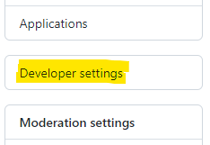

# Spring Security 5 OAuth2 Login Quickstart

This application demonstrates how to set up and configure a Spring Boot 2.x application to secure a REST API using Spring Security 5.3. Users are redirected to authenticate with GitHub using the OAuth2 `explicit grant` flow.

## GitHub Credentials

To use this sample you must have a valid GitHub account.

You will need to follow the steps below to set up an OAuth2 token for the application to access your GitHub account.

1. Log into [GitHub](https://github.com/)
2. Use the profile icon in the top-right of the screen to select `Settings`


3. From the `Settings` menu, select the `Developer Settings` section



4. From the `Developer settings` menu, select `OAuth Apps`


5. Click the `New OAuth App` button in the top-right

6. Complete the `Register a new OAuth application` form with the following details and click `Register application` to proceed.


7. Click the `Generate a new client secret` button


8. Confirm your credentials to complete the process:


9. You will be presented with your GitHub OAuth Client Secret.   


**Important:** You should make a note of both the Client ID and Client Secret which are needed when starting up the application.

## Getting Started

Build the application:

```shell
./mvnw package
```

Run the application with GitHub credentials provided on the CLI:
```shell
java \
  -Dspring.security.oauth2.client.registration.github.clientId="d9c976bc9a08ca500bc3" \
  -Dspring.security.oauth2.client.registration.github.clientSecret="af8530051f8b2127decee80b900dc55f578373ee" \
  -jar target/spring-security-5-oauth2-login.jar
```

### Environment variables
Execute using environment variables to pass the GitHub credentials which is more useful for containers:
```shell
export GITHUB_API_CLIENT_ID=d9c976bc9a08ca500bc3
export GITHUB_API_CLIENT_SECRET=af8530051f8b2127decee80b900dc55f578373ee
java -jar target/spring-security-5-oauth2-login.jar
```

## Development

If you wish to use Maven to build and run the application locally:
```shell
./mvnw spring-boot:run -Dspring-boot.run.jvmArguments="-Dspring.security.oauth2.client.registration.github.clientId=d9c976bc9a08ca500bc3 -Dspring.security.oauth2.client.registration.github.clientSecret=af8530051f8b2127decee80b900dc55f578373ee"
```

## Containerisation

Containerisation is provided by means of a [Dockerfile](https://docs.docker.com/engine/reference/builder/).

You can build and manage the container using the following Docker commands:

Build the application
```shell
./mvnw package -D skipTests
```

Build the Docker image:
```shell
docker image build -t spring-security-5-oauth2-login:1.0 .
```

Start the container:
```shell
docker container run \
--env GITHUB_API_CLIENT_ID=d9c976bc9a08ca500bc3 \
--env GITHUB_API_CLIENT_SECRET=af8530051f8b2127decee80b900dc55f578373ee \
--publish 5000:5000 \
--detach \
--name spring-security-5-oauth2-login \
spring-security-5-oauth2-login:1.0
```

Get direct access to the container:
```shell
docker exec -it spring-security-5-oauth2-login //bin//sh
printenv
```

## Continuous Integration

This example uses [GitHub Actions workflows](https://docs.github.com/en/actions) to build the main artifacts and to publish to [Docker Hub](https://hub.docker.com/)

GitHub Actions workflow configuration for the project:
```shell
.github/workflows/main
```

The configuration will perform the following steps:
1. Checkout code from GitHub
2. Setup Java 11
3. Build the application using Maven
4. Build Docker image
5. Login and push image to Docker Hub

The configuration will be triggered when:

- Git Push on the `main` branch
- Git Tag with a `v` prefix, e.g. `v1.0`
- GitHub Pull Request on the `main` branch

**Note:** The Docker image will not be pushed for GitHub Pull Requests

The Docker image created in Docker Hub will be tagged based on the type of event triggered in GitHub:
- Git Push to `main` branch will create/update Docker image tagged `main`
- Git Tag with a `v` prefix will create/update Docker image tagged `latest`
- Git Tag with a `v` prefix will create/update Docker image tagged with the version number e.g. `v1.0`

### Important
The workflow requires that you have set up two secrets in GitHub with the following names:
- DOCKERHUB_USERNAME
- DOCKERHUB_TOKEN

These values should correspond to an Access Token that you have previous setup in Docker Hub.

## Continuous Deployment

Once the image has been built to Docker Hub, we can issue a new command to deploy our application to Kubernetes.

Create a secret which holds the credentials for GitHub:
```shell
kubectl create secret generic github-oauth2-credentials --from-literal=GITHUB_API_CLIENT_ID='d9c976bc9a08ca500bc3' --from-literal=GITHUB_API_CLIENT_SECRET='af8530051f8b2127decee80b900dc55f578373ee'
```

Run the deployment and service configuration scripts:
```shell
kubectl apply -f ./kubernetes
```

Get the Deployment details:
```shell
kubectl get deployment spring-security-oauth2-login
```

Get the Service details:
```shell
kubectl get service spring-security-oauth2-login-external
```

Get the Pod details:
```shell
kubectl get pods
```

Check the environment variables are available in the Pod instance:
```shell
kubectl exec spring-security-oauth2-login-7cd7d46f58-zs62h -- printenv
```

To enable Kubernetes to monitor the health of the application we need to include [Spring Actuator](https://docs.spring.io/spring-boot/docs/current/reference/html/actuator.html).  

Once included, the following URL allows us to monitor the status of the application:
```shell
curl -o - http://localhost:5000/actuator/health
{"status":"UP"}
```

### Teardown

To teardown the Kubernetes instance for the application:
```shell
kubectl delete deployment/spring-security-oauth2-login
kubectl delete service/spring-security-oauth2-login-external
kubectl delete secret/github-oauth2-credentials
```